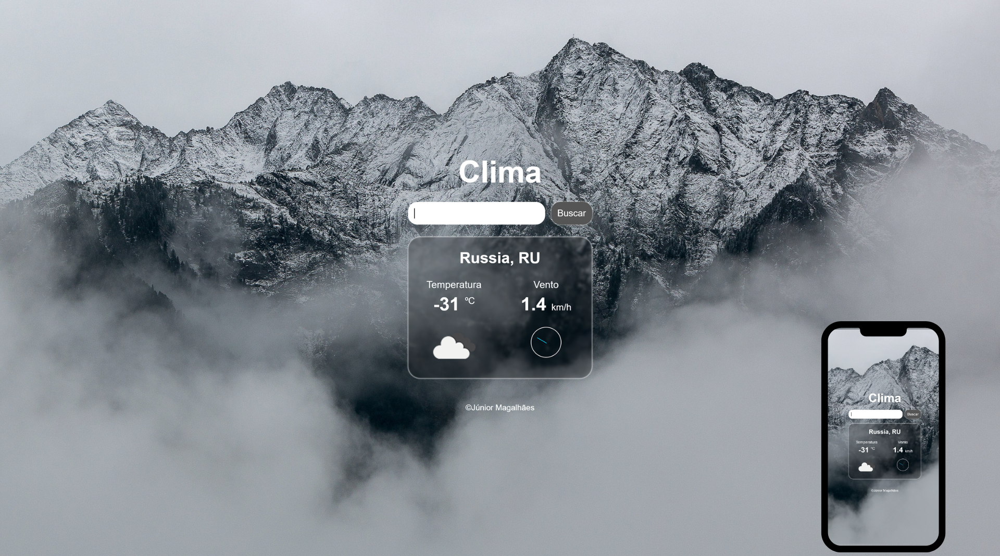

<h1 align="center">
  Clima
</h1>

  

## 🚀 Tecnologias

Esse projeto foi desenvolvido com as seguintes tecnologias:

- HTML e CSS
- JavaScript

## 💻 Projeto

- O projeto utiliza a Weather API para buscar dados climáticos.
- Projeto Responsivo.

- [Acesse o projeto finalizado, online](https://siteclima.web.app/)

## :memo: Licença

Esse projeto está sob a licença Júnior Magalhães.

---

Feito por by Júnior Magalhães 
